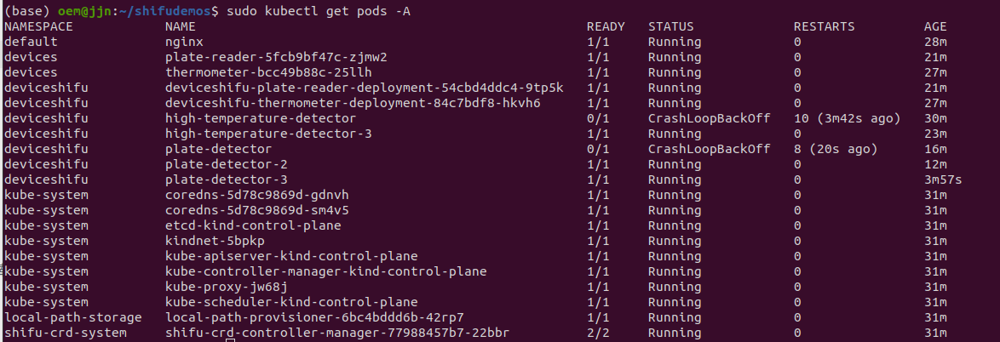

## 一. 安装 Shifu

运行以下脚本,安装并部署`shifu`

```bash
curl -sfL https://raw.githubusercontent.com/Edgenesis/shifu/main/test/scripts/shifu-demo-install.sh | sudo sh -
```

### 确认 Shifu 已启动

```bash
sudo kubectl get pods -A
```



确保下属指定的 `pod` 都是 `running` 状态:


## 二. 启动酶标仪

完成快速安装指南后，使用以下命令将目录切换到 shifudemos：

```shell
cd shifudemos
```

#### 2.1 创建数字孪生

首先，我们启动酶标仪的数字孪生：

```shell
sudo kubectl apply -f run_dir/shifu/demo_device/edgedevice-plate-reader
```

我们可以看到酶标仪的数字孪生已经启动：

```shell
sudo kubectl get pods -A | grep plate
```


### 三. 构建一个酶标仪测试程序

通过 HTTP 请求来和 deviceShifu 交互，每两秒检测 `get_measurement` 节点来获取酶标仪  deviceShifu 的结构。

### 3.1 测试程序

测试程序源代码如下:

```go
package main

import (
	"fmt"
	"io/ioutil"
	"net/http"
	"strconv"
	"strings"
	"time"
)

var rotaionCycle = 3 * time.Second

func main() {
	targetUrl := "http://deviceshifu-plate-reader.deviceshifu.svc.cluster.local/get_measurement"
	//targetUrl := "http://deviceshifu-thermometer.deviceshifu.svc.cluster.local/read_value"
	req, _ := http.NewRequest("GET", targetUrl, nil)
	for {

		fmt.Printf("Time Now: %s\n", time.Now().Format("2006-01-02 15:04:05"))
		res, _ := http.DefaultClient.Do(req)
		body, _ := ioutil.ReadAll(res.Body)

		s := string(body)

		numbers := strings.Fields(s)

		var sum float64
		count := 0

		for _, numStr := range numbers {
			num, err := strconv.ParseFloat(numStr, 64)
			if err != nil {
				fmt.Printf("Error converting %s to float: %v\n", numStr, err)
				continue
			}
			sum += num
			count++
		}

		fmt.Println("测试数据: \n", string(body))
		avg := sum / float64(count)
		fmt.Printf("Average of numbers: %.2f\n", avg)
        fmt.Println()

		res.Body.Close()
		time.Sleep(rotaionCycle)
	}
}
```

生成 `go.mod`:

```SHELL
go mod init plate-detector
```

#### 3.2 容器化应用

**Dockerfile**

```dockerfile
# syntax=docker/dockerfile:1

FROM golang:1.17-alpine
WORKDIR /app
COPY go.mod ./
RUN go mod download
COPY *.go ./
RUN go build -o /plate-detector
EXPOSE 11111
CMD [ "/plate-detector" ] 
```

之后，创建应用：

```shell
docker build --tag plate-reader-detector:v0.0.1 .
```


#### 3.3 加载应用镜像并启动应用 Pod

首先将应用镜像加载到 `kind` 中：

```shell
sudo kind load docker-image plate-reader-detector:v0.0.1
```


之后运行容器 Pod：

```shell
sudo kubectl run plate-reader-detector --image=plate-reader-detector:v0.0.1 -n deviceshifu
```


#### 3.4 检查应用输出

测试程序设置的轮训时间是 `3s` , 因此每隔3s就会请求一次酶标仪, 并计算均值.

一切准备就绪，通过 log 来查看程序输出：

```bash
sudo kubectl logs -n deviceshifu plate-reader-detector -f
```

